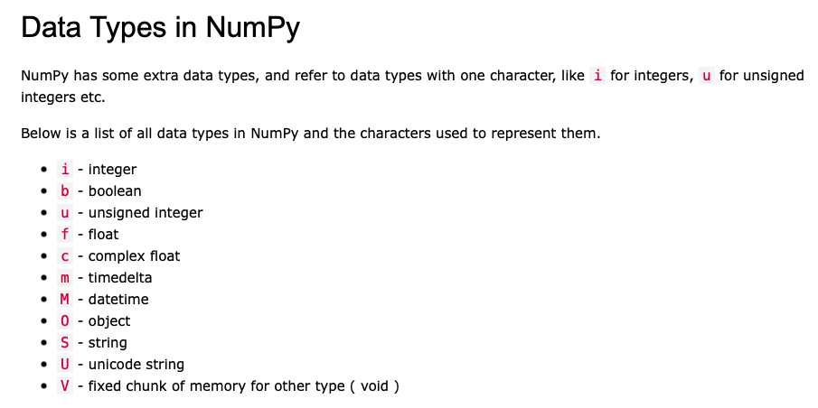
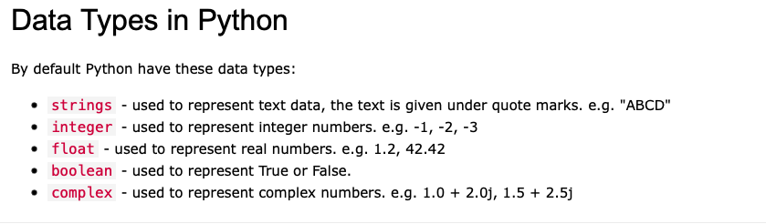
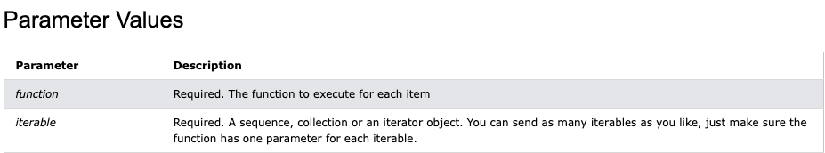

# Numpy tutorials

<i>@author: Nie</i>

<i>@date: 2023/2/10</i>

### Numpy data type






### Python map()

__map__ function is important to draw a graph and it is useful.

__Definition and Usage__ : The *map()* function execute a specified function for each item in an iterable.
The item is sent to function as a parameter

__Syntax__
```python
    map(function,iterable)
```



__Example__

```python
    def func(n):
        return len(n)
    ## a function definition

    x = map(func,('apple','cherry'))
```

#### References:

<a href="https://www.w3schools.com/python/numpy/">https://www.w3schools.com/python/numpy/</a>
